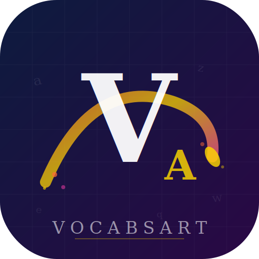

# VocabsArt Vocabulary Platform

  

  <strong>Build your vocabulary the smart way.</strong> 
  A feature-rich offline-ready vocabulary app with 832 curated words.

---

## Features

- 📚 **832 vocabulary words** with definitions, pronunciations, Bengali meanings, synonyms, antonyms, and example sentences
- 🗂️ **Idiom Library** — organized idiom sections sourced from the included idiom PDF
- 🃏 **Flashcards** — flip through cards with difficulty ratings (Know / Hard / Save)
- 🧠 **Quiz mode** — multiple choice questions: word meaning, synonym, antonym, and sentence completion
- 📝 **Exam mode** — timed 30-question exam to test your knowledge
- 🔖 **Bookmarks** — save words for later review
- 📊 **Progress tracking** — track learned words, weak words, streaks, and quiz accuracy
- 🔍 **Search** — instantly find any word by name, definition, or synonym
- ➕ **Add Word** — add your own custom words to the vocabulary list
- 🌙 **Dark theme** — elegant dark UI with gold accent colors
- 📱 **PWA / Offline** — installable as a Progressive Web App; works without internet
- 🇧🇩 **Bengali meanings** — optional Bengali translations for every word

## Pages

| Page | Description |
|------|-------------|
| **Home** | Overview with streak, progress, and quick stats |
| **Learn** | Browse all 832 words by letter or filter (Easy/Medium/Hard/Weak/Saved) |
| **Idioms** | Explore organized idiom sections with search support |
| **Cards** | Flashcard deck with flip animation and difficulty rating |
| **Quiz** | 20-question quiz with instant feedback |
| **Exam** | 30-question timed exam (15 minutes) |
| **More → Stats** | Detailed performance stats and category breakdown |
| **More → Admin** | Developer profile and contact info |
| **More → Add Word** | Form to add custom words to your vocabulary list |
| **More → Settings** | Toggle Bengali meanings, synonyms, examples, and weak-word focus |

## Tech Stack

- Vanilla HTML + CSS + JavaScript (no frameworks)
- Progressive Web App (PWA) with Service Worker for offline support
- Capacitor for Android APK packaging

## Getting Started

Simply open `index.html` in a browser — no build step required.

To install as a PWA, open the app in Chrome or Edge and use the browser's "Install" or "Add to Home Screen" option.

## Developer

**Kawsar Mahmud Tanveer Khan**  
BSc in EEE · Daffodil International University  
Creator & Developer of VocabsArt

- Facebook: [facebook.com/itzzVeer](https://facebook.com/itzzVeer)
- LinkedIn: [linkedin.com/in/KawsarTanveer](https://linkedin.com/in/KawsarTanveer)
- Email: tanveerk.eee@gmail.com
